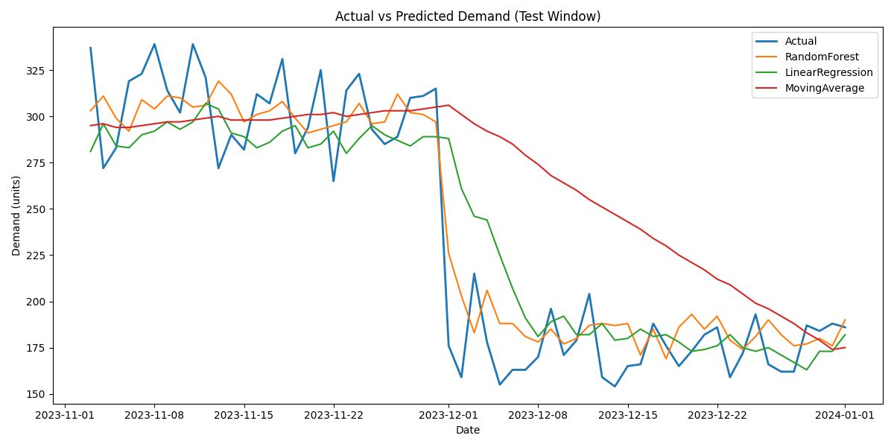
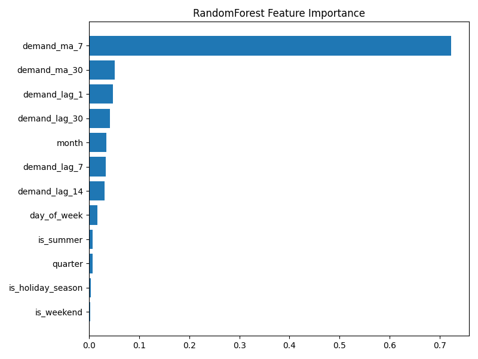
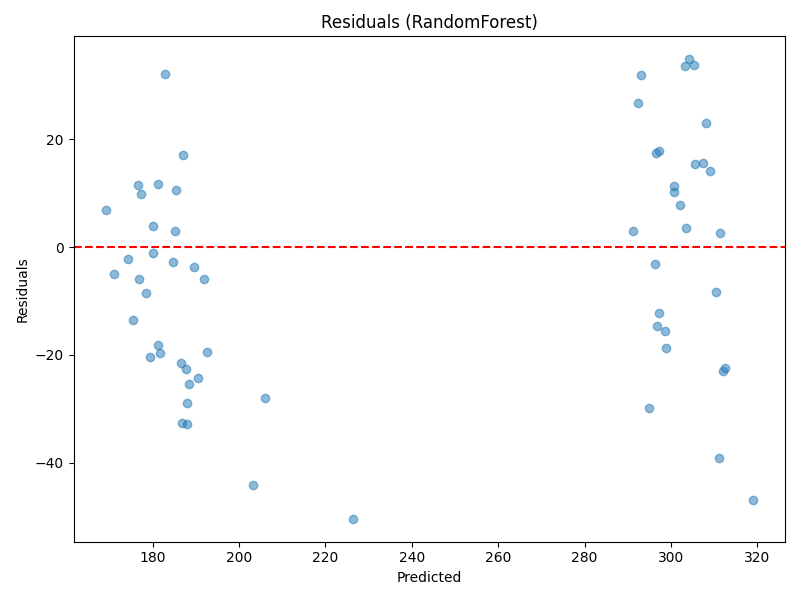

# Retail Sales Analytics & Demand Forecasting

## Project Overview
End-to-end analytics solution using **synthetic e-commerce retail data** to identify purchase patterns and build demand forecasting models for inventory optimization.

## Dataset
This project uses **synthetic data generated programmatically** to simulate realistic retail transactions (orders, customers, categories, prices).  
The file `sample_data.csv` is included only as an **example schema**.

## Business Problem
- Need to predict seasonal demand accurately  
- Identify cross-selling opportunities  
- Optimize inventory planning  

## Technical Approach
- Data cleaning and preprocessing  
- Exploratory data analysis (EDA)  
- Time series forecasting (Random Forest, Regression, Baseline)  
- Executive-level dashboards and customer analysis  

## Files in this project
- [`data_analysis.py`](data_analysis.py) – Comprehensive EDA and cleaning  
- [`demand_forecasting.py`](demand_forecasting.py) – Forecasting models and evaluation  
- [`data_visualization.py`](data_visualization.py) – Executive dashboards and customer analysis  
- [`sample_data.csv`](sample_data.csv) – Example dataset schema  
- [`requirements.txt`](requirements.txt) – Required Python packages  

## How to Run
```bash
# Install dependencies
pip install -r requirements.txt

# Run individual scripts
python data_analysis.py
python demand_forecasting.py
python data_visualization.py
```
The project produces aggregated reports, forecasting metrics, and visual dashboards.

### Model Performance

| Model            |   MAE  |  RMSE  |  MAPE  |   R²   |
|------------------|--------|--------|--------|--------|
| RandomForest     | 18.02  | 21.73  |  8.28% | 0.896  |
| LinearRegression | 23.83  | 32.47  | 11.07% | 0.768  |
| MovingAverage    | 43.43  | 57.55  | 23.10% | 0.270  |

### Forecast Visualizations

- **Actual vs Predicted Demand**
  

- **Feature Importance (RandomForest)**
  

- **Residuals (RandomForest)**
  

### Future Forecast

The system also generates a **30-day demand forecast** saved as:
