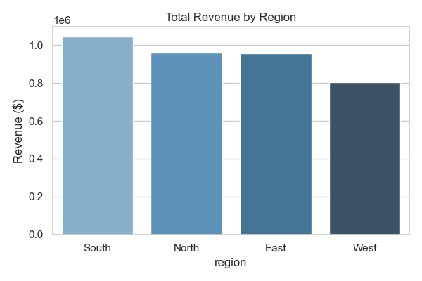
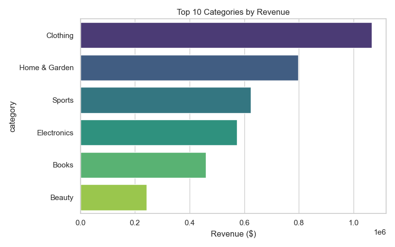
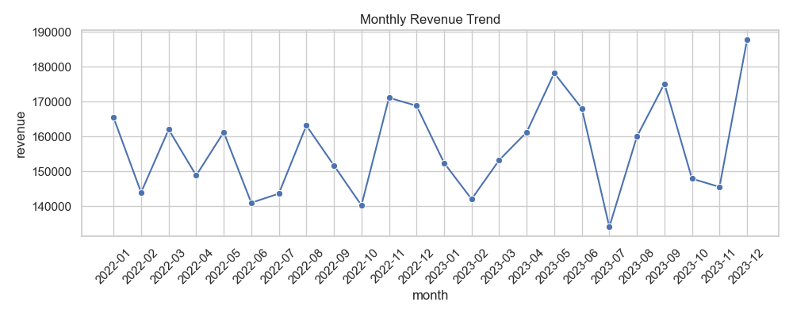

# Sales & Marketing Dashboard Project

## Project Overview
An end-to-end data analytics pipeline simulating sales and marketing data for a retail company.  
The project demonstrates **data generation, database creation, SQL analysis, and dashboard reporting**.

## Dataset
This project uses **synthetic data generated programmatically** (customers, products, sales).  
The file structure ensures reproducibility and mimics real-world retail transaction data.  

Generated files include:
- `customers.csv` – Customer demographics and region info
- `products.csv` – Product categories and details
- `sales.csv` – Transaction-level sales records

## Business Problem
- Understand revenue trends by region and category  
- Identify top-performing products and categories  
- Track customer behavior (average order value, repeat purchases)  
- Provide a foundation for sales and marketing dashboards  

## Technical Approach
1. **Data Generation** – `00_generate_data.py` creates synthetic datasets.  
2. **Database Creation** – `01_create_sqlite_db.py` stores data in SQLite.  
3. **SQL Queries** – `02_run_queries.py` executes business queries and exports CSV reports.  
4. **Dashboards** – `dashboard_visuals.py` generates charts for key KPIs.  
5. **Power BI** – `power_bi_instructions.md` explains how to replicate visuals in BI tools.  

## Files in this Project
- [`00_generate_data.py`](00_generate_data.py) – Synthetic dataset generator  
- [`01_create_sqlite_db.py`](01_create_sqlite_db.py) – Creates SQLite database  
- [`02_run_queries.py`](02_run_queries.py) – Executes SQL queries and exports results  
- [`queries.sql`](queries.sql) – SQL scripts for analysis  
- [`dashboard_visuals.py`](dashboard_visuals.py) – Generates visual reports (PNG)  
- [`power_bi_instructions.md`](power_bi_instructions.md) – BI replication guide  
- [`requirements.txt`](requirements.txt) – Python dependencies  
- **Outputs**: CSV files in `reports/queries/` and visuals in `reports/visuals/` (ignored in Git)

## How to Run
```bash
# Install dependencies
pip install -r requirements.txt

# Generate synthetic data
python 00_generate_data.py

# Create SQLite database
python 01_create_sqlite_db.py

# Run SQL queries and save reports
python 02_run_queries.py

# Generate dashboard visuals
python dashboard_visuals.py
```
## Results

The project produces both tabular reports (CSV files under `reports/queries/`) and visual dashboards.  
Below are some of the generated charts:

### Revenue by Region


### Top Categories by Revenue


### Monthly Sales Trend

